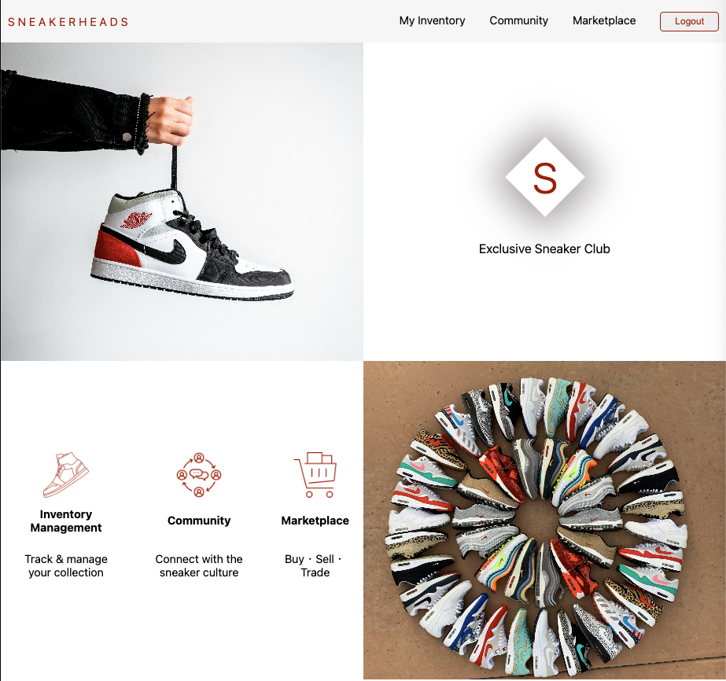

# SNEAKERHEADS

## [Visit SNEAKERHEADS Here](https://sneakerheads.fly.dev/)
What is a sneakerhead? "A person who collects and trades sneakers as a hobby, and who typically is knowledgeable about the history of sneakers." - [Dictionary.com](https://www.dictionary.com/browse/sneakerhead#:~:text=noun%20Slang.,ANSWER%20THESE%20COMMON%20GRAMMAR%20DEBATES%3F)

SNEAKERHEADS is an online platform that allows users to log & manage their sneaker collection, connect with other 'sneakerhead' users, and provide an outlet to buy or sell new or used sneakers. 

SNEAKERHEADS is inspired by my friends that have stacks and stacks of shoeboxes in their homes. I wanted to give them a 3-in-1 app to help manage, grow, or even decrease their sneaker collection. After all, it is an art form! 

Planning materials can be found [here](https://trello.com/b/zgSVJvGE/sneakerheads).

## Technologies Used
* Express
* Node.js
* Mongoose
* MongoDB
* Google OAuth
* EJS
* Javascript
* HTML
* CSS
* Git
* Docker

## Attributions
* Bedroom Image by [Freepik](https://www.freepik.com/free-photo/rubber-fig-gray-room_4100641.htm#query=empty%20wall&position=29&from_view=keyword&track=ais)
* Button Icons by [Font Awesome](https://fontawesome.com/)
* Favicon Image by [Flaticon](https://www.flaticon.com/free-icon/sneakers_2589903?term=sneaker&related_id=2589904&origin=search)
* Log-in Landing Page & Marketplace Images by [Unsplash](https://unsplash.com/)
* Mobile Menu Nav Bar by [Alvaro Trigo](https://alvarotrigo.com/blog/hamburger-menu-css/)
* Shoebox Images by [ICONFINDER: Fopifopi](https://www.iconfinder.com/iconsets/shoes-box)

## Ice Box
- [X] Add a marketplace page for users to view current sneakers for sale by other users.
- [ ] Add a user to upload their own image.
- [ ] Add search fields for marketplace based on brand, nickname, release year, and price.