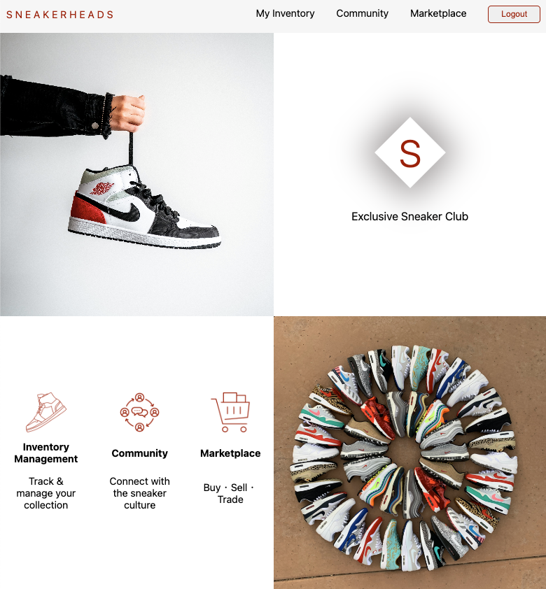

# SNEAKERHEADS

## [Visit SNEAKERHEADS Here](https://sneakerheads.fly.dev/)
SNEAKERHEADS is an online platform that allows users to log & manage their sneaker collection, connect with other 'sneakerhead' users, and provide an outlet to buy or sell new or used sneakers. 

SNEAKERHEADS is inspired by my friends that have stacks and stacks of shoeboxes in their homes. I wanted to give them a 3-in-1 app to help manage, grow, or even decrease their sneaker collection. Sneakers are an art form! So if the shoe fits ... wear it, catalog it, and share it! 

Planning materials can be found [here](https://trello.com/b/zgSVJvGE/sneakerheads).

## Technologies Used
* Express
* Node.js
* Mongoose
* MongoDB
* Google OAuth
* EJS
* Javascript
* CSS
* Git
* Fly.io

## Attributions
* Bedroom Images by [Freepik](https://www.freepik.com/free-photo/rubber-fig-gray-room_4100641.htm#query=empty%20wall&position=29&from_view=keyword&track=ais)
* Button Icons by [Font Awesome](https://fontawesome.com/)
* Favicon Image by [Flaticon](https://www.flaticon.com/free-icon/sneakers_2589903?term=sneaker&related_id=2589904&origin=search)
* Log-in Landing Page & Marketplace Images by [Unsplash](https://unsplash.com/)
* Mobile Menu Nav Bar by [Alvaro Trigo](https://alvarotrigo.com/blog/hamburger-menu-css/)
* Shoebox Images by [ICONFINDER: Fopifopi](https://www.iconfinder.com/iconsets/shoes-box)

## Ice Box
- [X] Add a marketplace page for users to view current sneakers for sale by other users.
- [ ] Add 'email seller' functionality for potential buyer.
- [ ] Add a user to upload their own image.
- [ ] Add search fields for marketplace based on brand, nickname, release year, and price.
- [ ] Add mobile friendly views. 